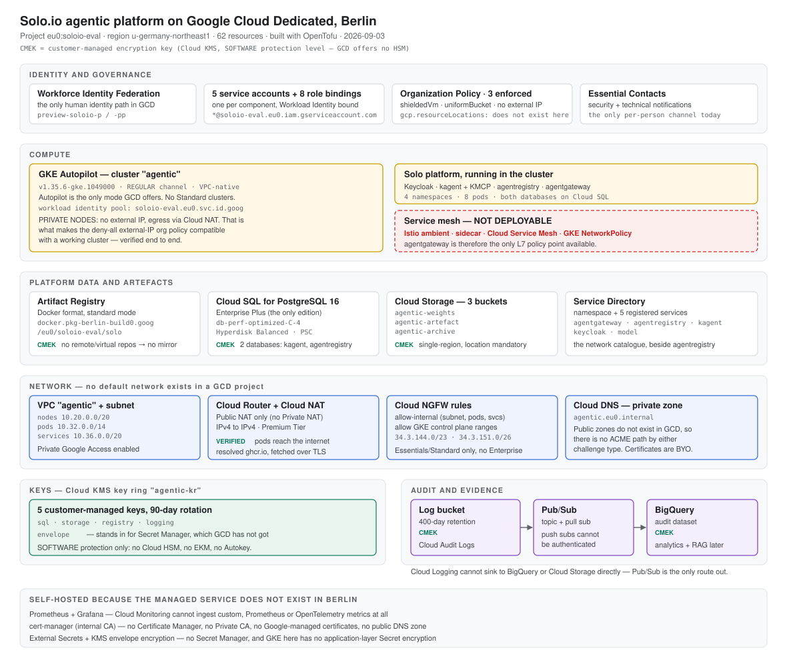

# Solo.io agentic platform on Google Cloud Dedicated (Berlin)

**Project:** `eu0:soloio-eval` · **Region:** `u-germany-northeast1` · **Date:** 2026-09-03
**Prepared by:** Tom O'Rourke, Field CTO EMEA, Solo.io
**Audience:** the GCD product and ISV teams

We have built and are running a Solo.io agentic-platform reference architecture in Berlin preview,
provisioned as code with OpenTofu. This document records what is deployed, which of Berlin's
services it exercises, what we had to self-host because the managed service is not available here,
and the findings we would like Google to look at.

The intent was deliberately not "the smallest thing that works". We wanted to exercise the universe
the way a regulated German customer would — private nodes, customer-managed keys on everything that
supports them, managed Postgres over Private Service Connect, private DNS, a real audit export path
— so that our feedback is grounded in something that actually runs.

**62 resources, 20 of Berlin's 31 services, 4 application namespaces, all currently running.**

> This document and `gcd-berlin-deployment.svg` travel together — the diagram is referenced as a
> sibling file, so send both.



---

## Status

### Infrastructure

| Area | What is running | Notes |
|---|---|---|
| **Cluster** | GKE Autopilot `agentic`, `v1.35.6-gke.1049000`, REGULAR channel, **private nodes** | Nodes take no external address and egress through Cloud NAT. Workload identity pool `soloio-eval.eu0.svc.id.goog`. |
| **Keys** | Cloud KMS key ring `agentic-kr` and five keys — `sql`, `storage`, `registry`, `logging`, `envelope` — on 90-day rotation | `SOFTWARE` protection level. See the sovereignty notes. |
| **Network** | VPC `agentic`; subnet with nodes `10.20.0.0/20`, pods `10.32.0.0/14`, services `10.36.0.0/20`; Cloud Router; Cloud NAT; two Cloud NGFW rules | Private Google Access on. A GCD project has no default network, so this is mandatory. |
| **Database** | Cloud SQL for PostgreSQL 16, Enterprise Plus, `db-perf-optimized-C-4`, Hyperdisk Balanced, CMEK, reached over a Private Service Connect endpoint at `10.20.0.5` | Two databases with separate owning users: `kagent` and `agentregistry`. |
| **Registry** | Artifact Registry `solo`, Docker format, standard mode, CMEK | `docker.pkg-berlin-build0.goog/eu0/soloio-eval/solo` |
| **Storage** | Three buckets — `agentic-weights`, `agentic-artefact`, `agentic-archive` — CMEK, versioned, uniform bucket-level access, public access prevented | Model weights, build artefacts, trace archive. |
| **DNS** | Cloud DNS private zone `agentic.eu0.internal` | Makes one OIDC issuer hostname resolve identically inside and outside the cluster. |
| **Identity** | Five service accounts, eight project role bindings, five Workload Identity bindings | One Google identity per platform component. |
| **Audit** | CMEK log bucket at 400-day retention, log sink, Pub/Sub topic and pull subscription, CMEK BigQuery dataset | Audit logs to the bucket for retention; sink to Pub/Sub to BigQuery for analytics. |
| **Catalogue** | Service Directory namespace and five registered services | Service Directory is the network catalogue; our agentregistry is the governance one. |
| **Governance** | Three Organization Policies — `compute.requireShieldedVm`, `storage.uniformBucketLevelAccess`, `compute.vmExternalIpAccess` deny-all — and Essential Contacts | The external-IP policy is only compatible with the cluster because nodes are private. |

### Application layer

| Namespace | Running | Version | Database |
|---|---|---|---|
| `keycloak` | Keycloak, the single OIDC issuer, realm `agentregistry` with five clients | 26.3 | in-memory (dev posture) |
| `kagent` | Solo Enterprise for kagent controller, bundled tool server, KMCP controller | 0.4.3 | **Cloud SQL** |
| `agentregistry-system` | AgentRegistry Enterprise server, ClickHouse, telemetry collector | 2026.6.1 | **Cloud SQL** |
| `agentgateway-system` | Solo Enterprise for agentgateway controller; both GatewayClasses `Accepted` | v2026.8.2 | n/a |

Both products run against managed Postgres rather than the charts' bundled instances. Verified
directly: the `kagent` database holds 13 tables and `current_database()` returns `kagent`, with no
Postgres pod and no PVC in the cluster.

### Verified behaviours worth recording

- **Public internet egress from a private Autopilot pod works, via Cloud NAT.** This was our
  highest-priority unknown, because Berlin has no `aiplatform` and we needed to know whether an
  in-cluster agent could reach anything at all. A pod on a node with no external address resolved
  `ghcr.io`, presented NAT source IP `34.3.134.229`, and got the expected `HTTP 401` from the
  registry API. Direct image pulls from `ghcr.io` and `quay.io` also succeed.
- **Private nodes, the deny-all external-IP org policy, and Cloud NAT all hold together.** A node
  provisioned successfully with the policy in force and retained full egress.
- **Cloud SQL over Private Service Connect is reachable from the cluster** —
  `10.20.0.5:5432 - accepting connections`.
- **The documented identity and naming patterns hold exactly.** Service account emails are
  `NAME@soloio-eval.eu0.iam.gserviceaccount.com` with no universe prefix on the project part; the
  workload identity pool is `soloio-eval.eu0.svc.id.goog`; service agents sit at
  `…@<service>.eu0-system.iam.gserviceaccount.com`.
- **CMEK works across Artifact Registry, Cloud SQL, Cloud Storage, Cloud Logging and BigQuery.**
- **Autopilot admits more than expected**: `hostAliases` is accepted, and a `StatefulSet` with a
  `PersistentVolumeClaim` passes admission.
- **GKE Gateway classes are present**, including `gke-l7-regional-external-managed` and
  `gke-l7-rilb`, so a Google-managed regional load balancer can front our own data plane.
- **More StorageClasses than expected**, including `hyperdisk-balanced` as default and three
  `gcsfusecsi-*` classes, which are useful for mounting model weights.

- **AgentRegistry can deploy an agent into kagent using only its own in-cluster identity.** The
  seeded `kubernetes-default` runtime carries no kubeconfig, so the registry acts as its own
  ServiceAccount. That account can create `agents.kagent.dev` and `remotemcpservers.kagent.dev` and
  cannot create raw `deployments.apps`, which is the right split: kagent's controller owns the
  workload. An agent published to the catalogue reached the cluster with no `kubectl` involved.
- **The registry stamps the OTel tracing endpoint into every agent it deploys**, so the audit trail
  is a platform property rather than something an application team has to remember. Spans land in
  the self-hosted ClickHouse and render as a trace tree with a named `execute_tool` span.

### Since superseded

An earlier revision of this document listed the ingress Gateway, the self-hosted model, the cluster
baseline and the MCP tool-authorization test as staged but not deployed. All are now deployed and
tested; see `gcd-berlin-agentic-test.md` for the functional record.

Two access problems recorded earlier as blockers turned out to be workable and are written up in
that document instead: `arctl` reaching the in-universe registry, and a browser reaching the
consoles. Both need a workaround that every ISV will need, which is the finding, but neither stops
the platform working.

---

## Findings for the GCD platform team

Each is written up in full, with verbatim command output, under `feedback/google/`.

### 1. There was no service mesh available by any route — RESOLVED 2026-09-04

GKE on GCD is Autopilot-only. Autopilot rejects the privileged DaemonSets Istio ambient requires —
`istio-cni` needs `hostNetwork` and `SYS_ADMIN`; `ztunnel` needs `SYS_ADMIN`, `NET_ADMIN` and
`runAsUser: 0`. GCD does not support the `WorkloadAllowlist` mechanism that would be the only way
to grant them. Cloud Service Mesh is unavailable. GKE network policies are listed as unavailable
too.

A GCD workload therefore has no in-cluster L4/L7 policy mechanism at all. Combined with no
load-balancer mTLS or authorization policies, no Cloud NGFW Enterprise and no Cloud Armor
Enterprise, the only available policy and audit point is an application-layer gateway that the
customer runs themselves. It also means no identity-based encryption between workloads, which we
are careful to state plainly rather than imply otherwise.

**Ask:** either `WorkloadAllowlist` support in GCD Autopilot, or GKE Standard clusters. This is the
one item on this list that no amount of engineering on our side resolves.


**Update 2026-09-04: resolved.** Istio ambient is running on this Autopilot cluster, admitted
through customer-owned `WorkloadAllowlist` objects. Privileged Admission Control had shipped in
GCD without our knowing: Berlin's GKE differences page still states that allowlists are not
supported, which is why this was written as a structural blocker. Workload mTLS, L4 identity
policy and L7 waypoint policy are all verified enforcing. Method and the four defects still open
with Google: `istio-ambient-on-gcd-autopilot.md`.

Cloud Service Mesh remains unavailable, with Google indicating end of 2026 for GCD operators and
customer availability likely Q1 2027. So this is self-managed Istio, not managed CSM. GKE network
policies also remain unavailable; ambient's L4 authorization substitutes and is stronger, keying
on workload identity rather than IP.

### 2. There is no in-universe OIDC issuer for application workloads

Workforce Identity Federation solves human access to the console and API. It does not publish a
discovery document and JWKS that an application can validate tokens against, and every Google
product that would fill that role is absent: `identitytoolkit` (Identity Platform),
`cloudidentity`, `iap` and `firebase`.

Our products each require a standard OIDC issuer at install time. AgentRegistry Enterprise will not
even render its chart without one:

```
CHART CONFIGURATION ERROR:
oidc.issuer is required. AgentRegistry Enterprise requires an external OIDC identity provider.
oidc.clientId is required. AgentRegistry Enterprise requires the backend OIDC client ID.
oidc.publicClientId is required. AgentRegistry Enterprise requires the browser UI OIDC client ID.
```

We resolved it by self-hosting Keycloak, which works but adds a production dependency we now own —
its availability, database, backup, upgrade path and TLS, inside a universe with no Secret Manager
for its client secrets and no Certificate Manager for its certificate.

The alternative is worse for a sovereign customer: pointing the products at the customer's existing
IdP, which for most German enterprises is Entra ID or Okta, means tokens authorising workloads
inside a partner-operated isolated universe are minted outside that boundary, and the sovereign
workload's auth path depends on a service outside the perimeter. A compliance team will ask about
exactly this, and today GCD offers no way to avoid it.

**Ask:** expose a standard OIDC discovery endpoint and JWKS for a workforce pool so applications can
validate the same tokens the console accepts — the trust chain already exists. Failing that, bring
Identity Platform into the catalogue, or document self-hosting as the intended pattern so every ISV
does not independently rediscover it.

### 3. Just-in-time service agents block CMEK and cluster creation in confusing ways

Service agents are created on first resource use rather than on API enable. That produced three
separate failures:

- CMEK bucket creation failed until the Cloud Storage agent existed and held
  `roles/cloudkms.cryptoKeyEncrypterDecrypter` on the key.
- **Cluster creation failed with `Error 403: Required 'compute.subnetworks.get' permission`**,
  because the GKE service agent is created *without* its default roles. Granting
  `roles/container.serviceAgent` fixed it. The error names a subnet permission, which sends you
  looking at your own IAM rather than at a service agent that has no roles.
- BigQuery does not support `generateServiceIdentity` at all — it returns `Request contains an
  invalid argument` — and its CMEK agent follows a different naming pattern entirely:
  `bq-<NUM>@bigquery-encryption.eu0-system…` rather than `service-<NUM>@gcp-sa-<service>…`

Separately, `gcloud beta services identity create` needs the `beta` component, whose install prompt
cannot be suppressed with `--quiet`, so we call `generateServiceIdentity` over REST. Cloud Storage's
response to that call carries no email, so it has to come from `gcloud storage service-agent`.

**Ask:** document the required grant for the GKE service agent on the GKE differences page, and
either make `generateServiceIdentity` uniform across services or list the per-service exceptions.

### 4. A deny-all external-IP org policy silently breaks Autopilot node provisioning

Autopilot nodes take an external address by default. Applying
`constraints/compute.vmExternalIpAccess` deny-all therefore blocked every node provision:

```
ScaleUpFailed: Failed adding 1 nodes to group ... due to
Other.VM_EXTERNAL_IP_ACCESS_POLICY_CONSTRAINT; source errors: Instance
'gk3-agentic-nap-...' creation failed: Constraint
constraints/compute.vmExternalIpAccess violated for project 560780939237871
```

The cluster reported `RUNNING` with **zero nodes**, every pod stuck `Pending`, and a
`LoadBalancer` Service reporting `cannot EnsureLoadBalancer() with no hosts`. The presenting symptom
reads as a capacity or quota problem rather than a policy one.

The resolution is to run private nodes, which we have now done, and which we would expect to be the
recommended posture for a sovereign deployment anyway. Note that switching an existing cluster to
private nodes only affects *new* nodes; the pre-existing node kept its external address until it
was cycled.

**Ask:** note the interaction in the Autopilot documentation, and state that private nodes is the
supported way to hold both this policy and a working cluster.

### 5. `hyperdisk-balanced` has a 4 GB minimum, which breaks portable Helm charts

Hyperdisk Balanced is the only disk type in GCD and the default StorageClass. It enforces a 4 GB
floor:

```
CreateVolume failed to create single zonal disk pvc-0f36edd3-...: failed to insert zonal disk:
unknown Insert disk error: googleapi: Error 400: Disk size cannot be smaller than 4 GB for
disk type hyperdisk-balanced., badRequest
```

Any chart whose PVC default is below 4 GB fails here while working on public Google Cloud, where
pd-balanced allows 1 GB. The PVC sits `Pending` and the consuming workload fails with a
*connection* error, so the disk is not where anyone looks first.

**Ask:** call out the 4 GB minimum in the GKE or Compute Engine differences pages under storage. It
is a one-line addition and it is a portability trap for every ISV bringing a Helm chart.

### 6. `gcp.resourceLocations` does not exist

Applying it returns `Error 404: Requested entity was not found`. This is the org policy a sovereign
customer is most likely to ask for by name. It is also the one GCD arguably needs least, since the
universe has a single region — but a compliance team will still ask.

**Ask:** confirm whether the absence is intentional, so we can answer the question rather than
deflect it.

### 7. Preview project quotas are inherited from public Google Cloud

`gcloud compute regions describe` returns 113 metrics that do not match GCD's own machine
catalogue.

- **No `NVIDIA_H100_80GB_GPUS` metric exists**, even though `nvidia-h100-80gb` is offered in two
  zones and is the only accelerator the differences pages list. Instead there are metrics for K80,
  P100, P4, T4, V100, A100 and L4, none of which GCD offers.
- **`C3_CPUS` is capped at 24.** C3 is the only general-purpose family available, and because GKE
  is Autopilot-only we cannot trade it for another. Our platform layer alone requests roughly
  12–14 vCPU before any customer workload or model. Meanwhile `N2_CPUS`, `C2_CPUS` and `E2_CPUS`
  sit at 100 and `T2A_CPUS` (Arm) at 96, for families the docs say are unavailable.
- `PREEMPTIBLE_CPUS = 0`, while the Compute Engine differences page states Spot VMs are available
  for C3, M3 and A3 at up to 60% off.
- `COMMITTED_*` are 0 for every family except L4 and T2D, while three differences pages state
  spend-based CUDs are offered.
- `M3_CPUS = 0`, though M3 is documented as available.

The remediation path compounds this: quota increases must go through GCD support, whose
prerequisites — a public Google Cloud organisation, an Assured Workloads folder, an empty support
project, then up to 48 business hours — are themselves a multi-day task.

**Ask:** add an H100 quota metric, raise the default `C3_CPUS`, and prune the metric set to GCD's
actual catalogue so that `regions describe` can be used for capacity planning.

### 8. Container image references need a documented format

The key-differences page states that project IDs are "always used with their universe-specific
prefix", with service account names as the single documented exception. Container references are a
second exception, in a third form. Composing `<host>/<project-id>/<repo>` yields
`…/eu0:soloio-eval/solo/…`, which every OCI client rejects before any network call, because a colon
is not legal inside a reference path component:

```
error parsing reference: "...pkg-berlin-build0.goog/eu0:soloio-eval/solo/img:latest"
is not a valid repository/tag: invalid reference format
```

Artifact Registry itself handles this correctly. `registryUri` returns
`docker.pkg-berlin-build0.goog/eu0/soloio-eval/solo`, with the universe prefix as its own path
segment — and note there is **no `<region>-docker` host prefix** as there is on public Google Cloud.
So the product is right and the documentation is silent.

**Ask:** one paragraph and one example on the Artifact Registry differences page, pointing readers
at `gcloud artifacts repositories describe --format='value(registryUri)'` as authoritative.

### 9. The Terraform GCS backend has no `universe_domain` setting

The `google` provider accepts `universe_domain` as an argument. The `gcs` backend does not, and
fails before reading a single resource:

```
Error: Failed to get existing workspaces: querying Cloud Storage failed: ...
the configured universe domain ("googleapis.com") does not match the universe
domain found in the credentials ("apis-berlin-build0.goog")
```

The only lever is the `GOOGLE_CLOUD_UNIVERSE_DOMAIN` environment variable. Since GCD's own
documentation recommends Terraform and Fabric FAST as the supported landing-zone path, and keeping
state in-universe is the right answer for a sovereign environment, a backend argument would be
worth adding. It presents as a credentials problem rather than a backend one.

**Ask:** a `universe_domain` argument on the `gcs` backend, or a line in the Terraform differences
page naming the environment variable.

### 10. Workforce Identity Federation tokens expire in well under an hour

We were signed out four times during a single working day, roughly 45 minutes after each login, and
twice mid `tofu apply`. Because Workforce Identity Federation is the only human identity path in GCD
and there is no service account key to fall back on, a long-running automation cannot complete
unattended.

For an ISV building CI against GCD this is structural, and it compounds with the absence of any
documented pattern for federating GitHub Actions or GitLab into a GCD workload identity pool from
outside the universe.

**Ask:** a documented service-account or workload-identity path for automation, and confirmation of
the intended refresh-token lifetime.

### 11. Workload Identity bindings cannot be created in the same apply as the cluster

Minor, and arguably a Terraform constraint rather than a GCD one, but it shapes how an ISV writes
their landing zone. A Workload Identity binding needs the cluster's identity pool, which does not
exist until the cluster does, and `for_each` keys must be known at plan time — so gating the
bindings on the cluster output fails the whole plan with `Invalid for_each argument`. The platform
stage therefore has to run twice. Anyone adapting Fabric FAST for GCD will hit the same thing.

**Ask:** a note in the GKE differences page about the two-pass requirement.

---

### 12. The H100 is catalogued but no GPU node will ever provision

`nvidia-h100-80gb` and `a3-edgegpu-8g-nolssd` are both catalogued in `u-germany-northeast1`, in
zones `-a` and `-b`. A pod requesting one in exactly the form GKE Warden demands is admitted and
then stays `Pending` for ever:

```
Normal  NotTriggerScaleUp  cluster-autoscaler
  Pod didn't trigger scale-up: 6 node(s) didn't match Pod's node affinity/selector
```

We tried four variants. Two are rejected at admission, which tells us the expected form; the two
that use that form (`compute-class: Accelerator` plus `gke-accelerator: nvidia-h100-80gb`, with
either 8 GPUs or 1) are admitted and never scheduled. There is no `NVIDIA_H100_80GB_GPUS` metric
and no `A3_CPUS` metric, so a quota increase cannot even be requested.

The failure mode is the damaging part. Because the autoscaler reports a node affinity mismatch
rather than a quota or capacity error, an evaluating vendor concludes their manifest is wrong.

**Consequence:** Google's own reference architectures for this cloud depend on self-hosting an
open-weight model on this hardware, because the universe has no `aiplatform` and therefore no
managed inference. Without a GPU the only sovereign inference path is general-purpose CPU, which
proves an architecture but is not demonstrable to a regulated buyer. Neither Solo nor Google can
currently show the AI story the platform is positioned on.

**Ask:** confirm whether A3 capacity is allocated to this project and in which zones; confirm
whether the Autopilot `Accelerator` compute class has a backing node configuration in this
universe; publish the quota metric name; and state explicitly whether GPUs require a **Standard**
cluster. That last one matters most, because GCD's documented GKE offering is Autopilot-only, and
if Standard exists here it also changes finding 1.

---

## Google's responses, 2026-09-03

| Item | Google's position | What it means for us |
|---|---|---|
| GPUs | "GPUs should be available in the environment" | Not schedulable. Finding 12 has the verbatim evidence and the four asks; reply sent. |
| Service mesh | Cloud Service Mesh unavailable, on the roadmap. ETA end of 2026 for GCD operators, customer availability likely Q1 2027 | Confirms finding 1 for the whole of preview and the first year of GA. A customer running agents on GCD has no mesh, no mTLS between workloads and no network policy for that period. Strengthens the commercial position: agentgateway is not the better option here, it is the only one. |
| Identity | No native identity service; customers bring their own IdP and use workforce/workload identity federation. Additional workspace accounts offered for testing | Confirms finding 2 and validates the Keycloak approach. Take the accounts: the current `preview-soloio@id-berlin-build0.goog` is a shared org-level account with no per-person audit attribution, which is fine for evaluation and not viable for a regulated customer. |

One consequence worth chasing: if GPUs turn out to require a Standard cluster, then Standard
clusters exist in this universe, and Istio ambient becomes possible well before the Cloud Service
Mesh date. The GPU answer and the mesh answer are linked.

## For Solo engineering

Two chart items that surfaced only because GCD's constraints are tighter than public cloud. Neither
is a GCD problem.

**The kagent Enterprise chart's bundled Postgres cannot start on any platform with a ≥4 GB storage
floor.** `database.postgres.bundled.storage` defaults to `500Mi`, below the `hyperdisk-balanced`
minimum. The PVC sits `Pending` and the controller crash-loops on `database migration failed …
connection refused`, which points at the database rather than the disk. AgentRegistry Enterprise
defaults to `5Gi` and is unaffected. Suggest raising the kagent default to `4Gi`, or documenting the
floor. Either way, the chart's own comment already says the bundled instance is "for development and
evaluation only. Not suitable for production", and we followed that — both products now run on
managed Postgres.

**Worth confirming the intended external-database value shapes**, since they differ between the two
charts: kagent takes `database.postgres.url` or `urlFile` with `bundled.enabled=false`, while
AgentRegistry takes `database.postgres.type=external` with
`database.postgres.external.secretRef.{name,key}`. Both work; the asymmetry is just a small trap for
anyone wiring both.

---

## What we had to self-host, and why

Each of these replaces a Google service that is present on public Google Cloud but absent in Berlin.
None is unreasonable for a preview, but together they are the ISV onboarding cost.

| Self-hosted | Because Berlin has no… |
|---|---|
| Keycloak | No Identity Platform, Cloud Identity, IAP or Firebase — no in-universe OIDC issuer at all. See finding 2. |
| Prometheus + Grafana | Cloud Monitoring here cannot ingest custom, Prometheus or OpenTelemetry metrics, and has no dashboards, alerting policies or uptime checks. Google's own documentation recommends PromQL and Grafana. |
| cert-manager with an internal CA | No Certificate Manager, no Private CA, no Google-managed certificates, and no public Cloud DNS zone — so ACME is impossible by either challenge type and every certificate is BYO and hand-rotated. |
| External Secrets + KMS envelope encryption | No Secret Manager. GKE here also has no application-layer Secret encryption, so license keys and credentials otherwise sit in plaintext in etcd. |
| ClickHouse + OpenTelemetry collectors | The same Cloud Monitoring gap, for agent traces specifically. |
| Argo CD or Flux, when we get there | No Cloud Build, no Artifact Analysis, no Binary Authorization, no Config Connector or Config Controller, and Config Sync is manual-install only. A regulated buyer will ask about the supply-chain attestation gap. |

---

## Sovereignty claims we are being careful about

Because this material reaches customers, we hold ourselves to what is attributable.

- Cloud KMS in Berlin has **no HSM protection level** — neither multi-tenant nor single-tenant Cloud
  HSM — and no EKM and no Autokey. Software-protected CMEK is the ceiling. We will not describe these
  as HSM-backed keys, and any customer control framework requiring an HSM protection level is not
  satisfiable today.
- CMEK does **not** cover Kubernetes Secrets, because GKE here has no application-layer Secret
  encryption. We say that plainly rather than letting "CMEK everywhere" imply it.
- **There is no workload mTLS**, because there is no mesh. On GCD we get tool-level authorization and
  an audit trail at the gateway, but not identity-based encryption between workloads.
- SLAs and billing are with the operator, not with Google, and GCD runs its own SRE team on separate
  monitoring and alerting stacks.
- We use your naming: **"Google Cloud-powered encryption keys / Managed in Google Cloud Dedicated in
  Germany"**, not "Google-managed". That distinction is itself a sovereignty point and we would
  rather use your wording than invent our own.

---

## Code and evidence

All of the below is in the Solo.io evaluation repository and can be shared on request.

### Infrastructure as code — `infra/tofu/`

Fourteen modules behind two profiles, applied in stages so a failure is diagnosable. Validated
against the `google` provider 8.1.0. Nothing hardcodes a hostname: `berlin-build0` reads as a pre-GA
staging name, so every domain, registry and project id is templated from one variables file.

```
providers.tf              universe_domain from a variable, provider pinned high
backend.tf                GCS state, held in-universe
variables.tf              every domain, registry and project id templated
profiles/                 gcd-autopilot.tfvars · gcp-standard.tfvars
modules/kms               key ring + 5 keys, incl. the Secret Manager stand-in
modules/network           VPC, subnet, Cloud Router, Cloud NAT, Cloud NGFW
modules/gke-autopilot     the Autopilot cluster, private nodes
modules/gke-standard      placeholder — the profile where a mesh is possible
modules/registry          Artifact Registry, CMEK
modules/cloudsql          Postgres Enterprise Plus, CMEK, PSC endpoint, per-product databases
modules/storage           3 buckets, CMEK
modules/dns               Cloud DNS private zone
modules/iam               per-component service accounts + Workload Identity
modules/observability     log bucket, sink, Pub/Sub, BigQuery
modules/edge              regional external ALB, Cloud Armor, BYO TLS
modules/servicedirectory  namespace + service registrations
modules/governance        Organization Policy, Essential Contacts
modules/vpcsc             VPC Service Controls — documented, not enabled
```

### Scripts — `poc/2026-09-agentic-platform/scripts/`

| Script | Purpose |
|---|---|
| `05-validate.py` | Offline. Extracts every embedded Kubernetes manifest, parses it, then checks each pod spec against what Autopilot will admit — resource requests present, and none of `hostNetwork`, `hostPath`, `privileged`, `runAsUser: 0` or the `SYS_ADMIN`/`NET_ADMIN` capabilities. Needs no credentials. |
| `08-enable-apis.sh` | A fresh GCD project has only nine services enabled, and neither `compute` nor `container` is among them. Enables eighteen in one batched operation, then waits on a real read because propagation is uneven. |
| `00-preflight.sh` | Seventeen read-only probes, recording verbatim output as evidence. |
| `10-tofu.sh` | Staged apply: foundation, then service agents and KMS grants, then platform, then a second pass for Workload Identity bindings. |
| `15-mirror-images.sh` | Mirrors images into Artifact Registry, resolving the host from the API rather than composing it. |
| `20-cluster-probes.sh` | The probes needing a live cluster: egress, image pull, StorageClasses, admission, `hostAliases`, DNS, LoadBalancer, Gateway classes. |
| `25-cluster-baseline.sh` | cert-manager, External Secrets, Prometheus + Grafana. Mandatory here, not optional. |
| `30-keycloak.sh` | The single OIDC issuer, realm import, and the two confidential client secrets envelope-encrypted with Cloud KMS. |
| `40-kagent.sh` | Solo Enterprise for kagent against Cloud SQL, with the OBO signing key. |
| `45-telemetry.sh` | The Solo Enterprise management chart: ClickHouse, OTel collectors, the Enterprise UI. |
| `50-agentregistry.sh` | AgentRegistry Enterprise against Cloud SQL over PSC. |
| `60-model.sh` | Self-hosted Gemma, GPU profile or CPU fallback, fronted by agentgateway. |
| `70-agentgateway.sh` | Solo Enterprise for agentgateway on the standalone GatewayClass. |
| `80-ingress.sh`, `85-edge.sh` | The ingress Gateway and the Tier 1 regional external ALB with Cloud Armor. |
| `90-mcp-agent.sh`, `95-authz-*.sh` | Publish an MCP server, deploy an agent, then enforce tool-level authorization at the gateway. |
| `99-teardown.sh` | Ordered teardown — workloads first, so load balancers and network endpoint groups release cleanly. |

Supporting tooling: `gcd-auth.sh` (Workforce Identity Federation login), `gcd-docs.sh` (fetch the
Berlin doc set, which needs an `X-DevSite-Proxy: gcd` header), `derive-images.sh` (render every Helm
chart to derive the real image list rather than guessing it), `mirror-images.sh`.

### Evidence — `feedback/google/evidence/`

Verbatim command output for every finding: the 31-service catalogue, the 113 region quota metrics,
the in-cluster probe results, the container reference rejection, the node provisioning failure under
the external-IP policy, and the relevant `tpc-differences` pages as retrieved.

---

## Next

The ingress Gateway and Tier 1 edge, the self-hosted open-weight model behind agentgateway, and the
functional MCP tool-authorization test. We will extend this document when they are running.

The substantive question we would like to work through with you is finding 1. Everything else on
this list we can engineer around.
