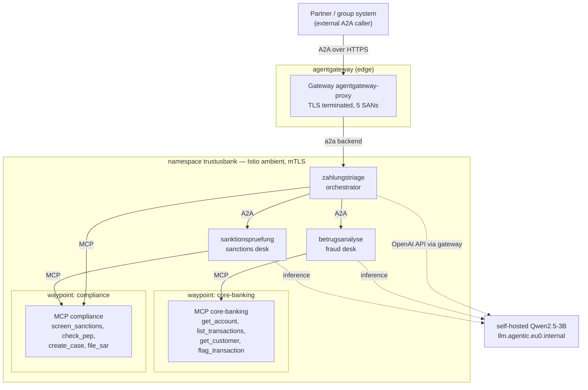
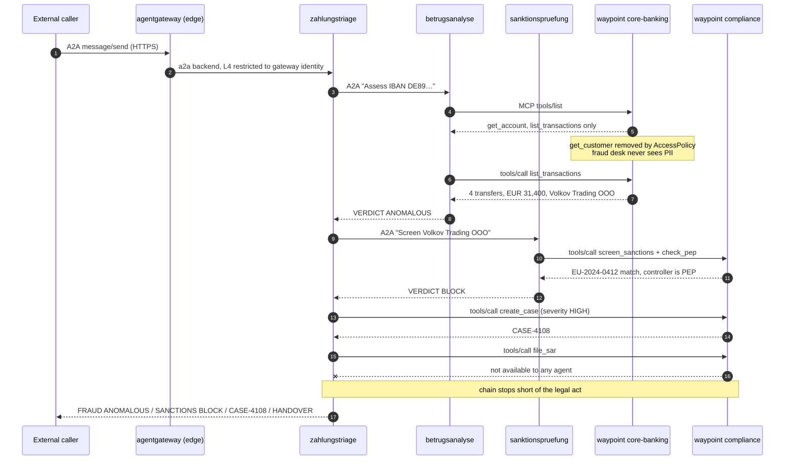

# TrustUsBank AG — SEPA Instant fraud triage with governed agents

**Status:** running and verified on GCD Berlin preview, 2026-09-07
**Lab:** `poc/2026-09-trustusbank/`
**Depends on:** `poc/2026-09-agentic-platform/` (cluster, ambient mesh, Keycloak, gateway, TLS, o11y)

A worked multi-agent scenario for a fictional German bank, built to answer one
question a regulated buyer always asks: *when an agent touches customer data or
moves money, what stops it, and can you prove it.*

TrustUsBank is invented. The data is invented. The regulatory framing (GwG,
BaFin, the EU Instant Payments Regulation, the EU consolidated sanctions list)
is real, and is what makes the control boundaries land.

---

## The scenario

A SEPA Instant transfer of **EUR 9,850** from `DE89 3704 0044 0532 0130 00` is
held by a velocity rule. It is the fourth transfer to the same new counterparty
in eighteen minutes, totalling EUR 31,400, against a normal weekly outflow of
**EUR 280**. Each amount sits just under the EUR 10,000 reporting threshold —
the pattern is the signal, not any single payment.

The counterparty, *Volkov Trading OOO*, matches the EU consolidated list. Its
controller is a PEP.

The Instant Payments Regulation gives the bank **seconds**, which is what makes
this agentic rather than a batch job.

Three agents split the work along the same lines a real financial-crime desk
does, and — the point of the exercise — along the same lines its **access
control** does.

| Agent | Desk | May call | Deliberately cannot |
|---|---|---|---|
| `zahlungstriage` | payment triage, orchestrator | `create_case` | `file_sar` |
| `betrugsanalyse` | fraud analysis | `get_account`, `list_transactions` | `get_customer` |
| `sanktionspruefung` | sanctions screening | `screen_sanctions`, `check_pep` | anything on core-banking |

---

## Who talks to what



**A2A** carries agent-to-agent delegation: the orchestrator to each specialist,
and the external caller to the orchestrator. **MCP** carries every tool call.
Both specialists reach their tools through a waypoint, never directly.

Agent-to-agent is declared, not coded — `tools[].type: Agent` with a Kubernetes
reference. kagent resolves it to the target agent's A2A endpoint and surfaces it
to the model as a callable tool named `trustusbank__NS__betrugsanalyse`.

---

## The flow



Verified output from `./scripts/demo.sh`:

```
Tools invoked: trustusbank__NS__betrugsanalyse,
               trustusbank__NS__sanktionspruefung, create_case
Outcome:       FRAUD: ANOMALOUS  SANCTIONS: BLOCK  CASE: CASE-4108
               HANDOVER: filing a report is reserved to a compliance officer
```

---

## The four controls, and how each was proved

Every agent **deliberately requests a tool it must not have**. If the agent spec
simply omitted them, the demo would prove only that we can write a short list.
Listing them and having policy remove them proves the boundary is enforced by
workload identity, and that no prompt wording talks its way past it.

Each denial is paired with a positive control on the same server, so a pass
cannot be an unreachable waypoint quietly reading as good news. Verification is
by **tool-call trace**, never by asking the model what it can do — a 3B model
recites tool names from its own configuration whether or not they are reachable,
which looks exactly like a policy failure.

`./scripts/health.sh` — **17 passed, 0 failed**.

| # | Control | Attempt | Result |
|---|---|---|---|
| 1 | **PII boundary** | fraud desk asked for name + date of birth | called `get_account`/`list_transactions`, never `get_customer`; no PII in the answer |
| 2 | **Separation of duties** | orchestrator told to file to the FIU | could not call `file_sar`; `create_case` still worked |
| 3 | **Tool scoping per identity** | sanctions desk asked for transactions | no tool call at all; `screen_sanctions` still worked |
| 4 | **Attributable identity** | — | all three agents ztunnel-captured with SPIFFE identities; only the gateway and kagent may open the orchestrator's A2A port |

Control 1 is the one worth showing an executive: **the fraud desk reaches a
verdict on a payment without ever being able to see who made it.** That is data
minimisation as a mechanism rather than a policy document.

This is not merely discovery filtering. Calling the MCP server **directly** from
the fraud desk's own pod, bypassing the agent's tool list entirely:

```
tools/list              -> ['get_account', 'list_transactions']
tools/call get_customer -> HTTP 400
```

The waypoint filters by caller identity, so a compromised or reprogrammed agent
gets the same answer as a cooperative one.

---

## Zero trust: what this build actually has

| Property | Status | Mechanism |
|---|---|---|
| No implicit network trust | **yes** | Istio ambient; ztunnel mediates every hop |
| Workload identity on every hop | **yes** | SPIFFE via ztunnel, `spiffe://cluster.local/ns/trustusbank/sa/<agent>` |
| Encrypted in transit, internal | **yes** | mTLS between all captured pods |
| Encrypted in transit, edge | **yes** | TLS on all five browser-facing hostnames, private CA via cert-manager |
| Authorization at L4 by identity | **yes** | Istio `AuthorizationPolicy`, incl. who may open the A2A port |
| Authorization at L7 per tool | **yes** | `AccessPolicy` → per-tool at the waypoint |
| Least privilege per agent | **yes** | three distinct AccessPolicies, allow-list semantics |
| Human identity on the tool call | **no** | see OBO below |
| Per-A2A-method authorization | **no** | not available in agentgateway today |
| Central audit of agent actions | **partial** | Prometheus with `source_principal` attribution; no immutable audit store |

Two honest gaps, both worth naming to a customer before they find them.

### 1. On-behalf-of / RFC 8693 — supported by the stack, not used here

We authorize by **workload** identity. The AccessPolicy subject is
`kind: Agent`, so the audit trail says *the fraud desk agent read the
transactions* — not *it read them on behalf of officer Schmidt*. For GwG and
DORA evidencing, attribution to a **person** is usually what is being asked for.

The capability is present and does not need building:

**agentgateway** implements OAuth 2.0 Token Exchange in
`AgentgatewayPolicy.spec.backend.auth.oauthTokenExchange`, with the full RFC 8693
surface — `subjectToken`, `actorToken` (including `mayAct: Required`),
`grantType`, `requestedTokenType`, `audiences`, `scopes`, `resources`, and
`clientAuth` up to `privateKeyJwt`. Also present: `crossAppAccess` and
`jwtSign`.

**kagent-enterprise** AccessPolicy can authorize on the delegation claim
directly. Instead of `kind: Agent`, a subject can be a user group evaluated
against the STS-issued token:

```yaml
from:
  subjects:
    - kind: UserGroup
      name: fraud-officers
      userGroup:
        issuer: "<STS issuer>"
        claimName: "act.sub"        # RFC 8693 actor claim
        claimValue: "<agent identity>"
        jwksKey:
          inline: '<jwks>'
```

`claimName: act.sub` is the RFC 8693 `act` claim: it authorizes on *who the
agent is acting for* plus *which agent is acting*. Upstream ships e2e coverage
for it at `kagent-enterprise/test/e2e/obo/`, and the `userGroup` fields are
present in the CRD installed on this cluster.

**Recommended next step.** Move these three AccessPolicies from `kind: Agent` to
`kind: UserGroup` on `act.sub`, with Keycloak as the STS and token exchange
configured on the gateway. The controls stay the same; the audit trail gains the
human. Until then, do not tell a bank that tool calls are attributable to a
named officer — they are attributable to a named *agent*.

### 2. A2A has no per-method authorization

`AgentgatewayPolicy.spec.backend` exposes `mcp.{authentication,authorization}`
but has **no `a2a` equivalent**. So MCP gets per-tool authorization while A2A is
all-or-nothing at the endpoint: you cannot allow `message/send` and deny
`tasks/cancel` at the gateway. Route-level `traffic.jwtAuthentication` and
`traffic.authorization` can gate the whole endpoint on claims, which is coarser.

What we do instead on that hop is L4 identity: an `AuthorizationPolicy` admits
only the gateway and kagent controller identities to the orchestrator's A2A port,
so an unauthorised pod is refused by ztunnel before the agent sees a byte.

That asymmetry between the MCP and A2A stories is a genuine product gap and is
the strongest of the feedback items this lab produced.

---

## Two implementation findings

**A waypoint per MCP server is currently mandatory.** The obvious optimisation —
one namespace waypoint, `istio.io/use-waypoint` on the namespace — carries the
traffic but silently loses per-tool enforcement. The cause is in
`kmcp-enterprise/.../translator/waypoint.go`: the `kagent.solo.io/waypoint`
label does three things, not one. It creates the Gateway (name derived as
`<kind>-<name>-waypoint`, not configurable), sets `istio.io/use-waypoint` on the
Service, **and sets `appProtocol: kgateway.dev/mcp`** on the service port — that
last one is what makes the waypoint MCP-aware. Removing the label runs
`cleanupWaypointResources()`, which deletes the Gateway and strips the
`use-waypoint` label, and the appProtocol is never applied. There is no spec
field to point at a pre-existing waypoint.

What *is* removable is the **per-agent** waypoint. Labelling an Agent gives it
its own waypoint, and since A2A has no per-method authorization, an L7 waypoint
in front of an agent buys observability rather than policy — the real control on
that hop is L4 identity, which costs no pods. Dropping those took this namespace
from **five waypoints to two**, which matters on Autopilot where each is a real
reservation against the 24 vCPU C3_CPUS quota; the five only scheduled after the
cluster added a node. To reach exactly one, both MCP servers would have to merge
into a single `MCPServer` exposing all eight tools — AccessPolicy scopes by tool
name, so all four controls would still hold, at the cost of modelling two
genuinely separate bank systems as one.

**`istioNetwork` is unset on this cluster.** kagent-enterprise's own
`_docs/platform/agw-waypoint-params.md` states that the Istio network is *always*
required for ambient HBONE routing, and that without it "ztunnel bypasses the
waypoint entirely and `AccessPolicy` enforcement is silently skipped". On this
cluster `topology.istio.io/network` on `istio-system` is empty, no
`EnterpriseAgentgatewayParameters` exists, and the waypoint GatewayClass has no
`parametersRef` — yet enforcement demonstrably works, including on a direct
call that bypasses the agent. The reasonable reading is that this is a
single-network cluster where the default path happens to route correctly. It
should still be set explicitly before anyone relies on this in front of a
customer: a control whose failure mode is *silently skipped* is exactly the one
you do not want depending on a default.

---

## Running it

```bash
cd poc/2026-09-trustusbank
./scripts/deploy.sh     # namespace, MCP servers, agents, policies, A2A edge
./scripts/demo.sh       # the scenario, end to end
./scripts/health.sh     # try to break all four controls (expect 17/0)
```

`./scripts/deploy.sh --ambient` applies only the mesh-enrolment step, which also
brings `agentregistry-system` and `mcp` into ambient — before that change the
AgentRegistry-deployed agent was the one workload in the stack with neither a
gateway policy nor an mTLS identity.

Allow two to four minutes for the scenario: three agents and several tool calls
on a 3B model on CPU. There is no schedulable GPU in Berlin
(`feedback/google/12`), so in-boundary inference is CPU-bound by construction.

## Customer Value

The problem: an agent that can reach a core banking system can, by default,
reach all of it — and an auditor cannot tell which flows happened or why they
were permitted. The benefit here is specific and demonstrable: a fraud
assessment completed with **zero** access to customer personal data, a
regulatory filing that remains impossible for any agent to submit, and every hop
carrying a cryptographic identity. The differentiator is that all of it is
declarative and enforced outside the agent — a competitor's answer to "stop the
agent reading PII" is a sentence in a system prompt, which the next model
revision may ignore.

**Worth noting:** the honest limit is human attribution. Today the trail names
the agent, not the officer. RFC 8693 token exchange closes that and is already
in the product — it is configuration, not roadmap, and it should be the next
thing built on this lab.
